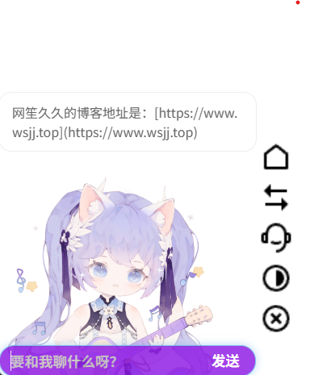

# Chat-GPT_SoVITS-Live2D
基于pio框架二开的web看板娘，可模型自己定制，支持与模型进行对话，并用文字和GPT-SoVITS生成相应模型的语音进行回复，是一个很有趣，又与时俱进的live2d项目（保留原作者vits语音回复功能）

基于aYYbsYYa大佬的chat-vits-live2d二次开发，原项目地址：https://github.com/aYYbsYYa/chat-vits-live2d

感谢[红血球AE3803](https://space.bilibili.com/6589795) [白菜工厂1145号员工](https://space.bilibili.com/518098961) [花儿不哭](https://space.bilibili.com/5760446)提供的模型以及GPT-SoVITS整合包

## 功能介绍

新增对DeepSeek、OpenAI、MaxKB知识库、GPT-SoVITS的支持

优化体验：回车Enter键发送消息

移除原项目PHP对话接口

### 配置步骤

1.**获取GPT-SoVIST密钥**

- 访问[AI Hobbyist TTS](https://tts.acgnai.top/) 注册账号并获取 API 密钥
- 或者本地搭建一个[整合包及模型下载链接](https://www.yuque.com/baicaigongchang1145haoyuangong/ib3g1e/dkxgpiy9zb96hob4)
- [GPT-SoVITS指南](https://www.yuque.com/baicaigongchang1145haoyuangong/ib3g1e?#)

2.**配置 API 密钥**

- 打开 `pio.js` 文件
- 找到 `GPT_SOVITS_PUBLIC_ENABLED` 变量或 `GPT_SOVITS_LOCAL_API_URL`
- 将 `YOU_GPT_SOVITS_API_KEY` 替换为你的实际API密钥
- 或使用本地`python.exe gsvi.py -p 8000 -k`指定你的`YOU_GPT_SOVITS_APP_KEY`

3.**配置GPT-SoVITS模型**

- 在WebUI界面点击模型库
- 选择心仪的模型下载
- 打开 `pio.js` 文件
- 将`原神-中文-芙宁娜_ZH`替换为你的实际模型名字（格式：游戏名-语言-角色名\_ZH）

4.**获取 DeepSeek API 密钥**

- 访问 [DeepSeek 官网](https://platform.deepseek.com/)
- 注册账号并获取 API 密钥

5.**配置 API 密钥**

- 打开 `pio.js` 文件
- 找到 `DEEPSEEK_API_KEY` 变量
- 将 `YOUR_DEEPSEEK_API_KEY` 替换为你的实际API密钥

6.**自定义AI设定**

- 在 `pio.js` 中找到 `SYSTEM_PROMPT` 变量
- 修改提示词来定义AI的性格和行为

7.**获取MaxKB API 密钥（可选择）**

- 访问`MaxKB`控制台
- 创建模型
- 创建应用

8.**配置 API 密钥**

- 打开 `pio.js` 文件
- 复制`API地址`替换`https://localhost/chat/api/YOU_CHAT_ID`
- 复制`API密钥`替换`YOU_MAXKB_API_KEY`
- 复制`模型名字`替换`YOU_MAXKB_MODEL`

### 演示地址

https://sbmihoyo.com（需在PC端打开，移动端不会进行加载）



### 引用方式

把`live2d`放到网页的根目录，最后把下面这段代码放到html页面的`head`或者`body`中即可

```html
<script src="live2d/Loading.js" type="text/javascript"></script>
```

